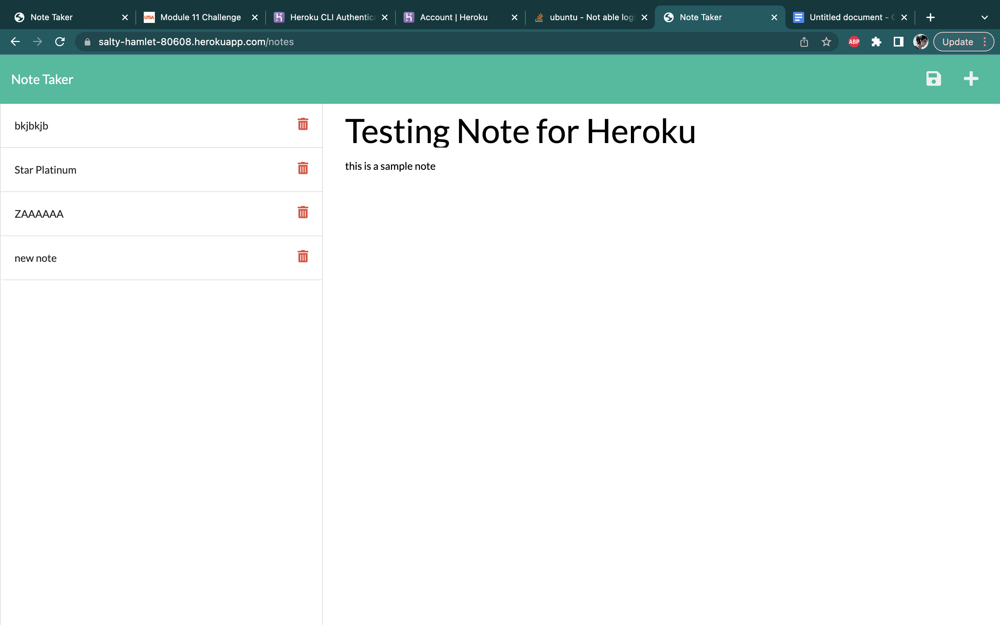
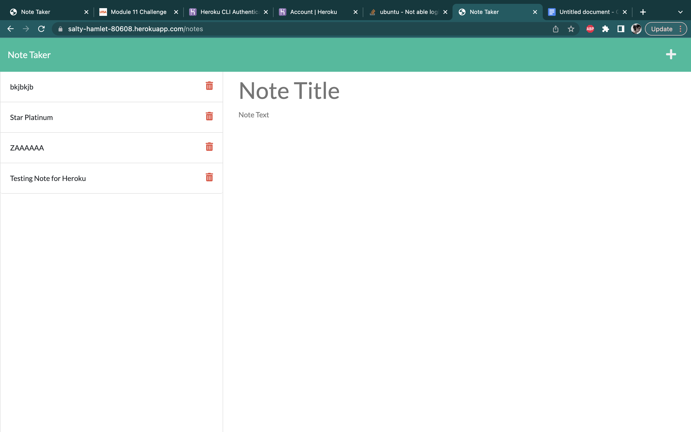

# Note Taker Starter Code

## Description 
This is the challenge for module 11 express.js. We had to create GET and POST requests in order to add and save notes to a webpage. This site then needed to be deployed to heroku in order to test the sites functionality. The website will be linked below. 

## Deployed Site 
[Express-Note-Taker](https://salty-hamlet-80608.herokuapp.com)

## 

